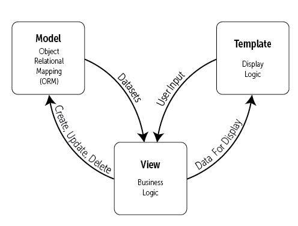

#### Structure of Directories & Files
```
views/                                  # Web applications and web services
├── applications/                       # Django applications for website
│   ├── admin/                          # Admin mode
│   │   └── Customize/                  # Admin page customize page handler - NOT USED
│   ├── public/                         # Public mode
│   │   ├── AdvancedSearch/             # NOT USED
│   │   ├── Blast/
│   │   ├── EditImage/
│   │   ├── GBrowse/
│   │   ├── Home/
│   │   ├── Images/                     # Image Viewer application
│   │   ├── iSearch/                    # Image Search application
│   │   ├── Login/
│   │   ├── Logout/
│   │   ├── Media/
│   │   └── Search/                     # NOT USED
│   └── registered/
│       ├── Administration/             # Admin page application
│       ├── ImageUploader/              # Image manual uploader
│       └── TGManager/                  # NOT USED
├── pagelets/                           # Web page UI applications
│   ├── admin/                          # Admin mode
│   │   ├── CustomizePagelet.py         # Pagelet for the customization of the website
│   │   └── ImageEditorPagelet.py       # Pagelet for the Image Editor for admin mode
│   ├── public/                         # Public mode
│   │   ├── AdvancedSearchPagelet.py    # NOT USED
│   │   ├── BlastPagelet.py
│   │   ├── BlastResultsPagelet.py
│   │   ├── FooterPagelet.py
│   │   ├── GBrowsePagelet.py           # NOT USED
│   │   ├── GBrowseSearchPagelet.py     # NOT USED
│   │   ├── HomePagelet.py              # Pagelet for the main page (Home)
│   │   ├── ImageEditorPagelet.py       # Pagelet for the Image Editor for public mode
│   │   ├── ImageSearchPagelet.py       # Pagelet for the Search page (NOT USED)
│   │   ├── ImagesPagelet.py            # Pagelet for the Image page
│   │   ├── iSearchPagelet.py           # Pagelet for the Image Search page
│   │   └── NavBarPagelet.py            # Pagelet for the Navigation Bar (Public mode)
│   └── registered/                     # Admin mode
│       ├── ImageUploaderPagelet.py     # Pagelet for the Manual Image Upload page
│       ├── NavBarPagelet.py            # Pagelet for the Navigation Bar (Admin mode)
│       ├── TGManagerPagelet.py
│       └── WorkbenchPagelet.py         # Pagelet for the Workbench page (Admin mode)
├── util/
│   ├── ErrorConstants.py
│   └── Util.py
└── webServices/                        # Web service (Ajax) applications
    ├── AggregateTagGroups/
    ├── AggregateTagGroupsSearch/
    ├── GeneLinks/                      # Ajax application for GeneLinks data
    ├── Images/                         # Ajax application for images data
    ├── Login/
    ├── Notes/                          # Ajax application for image notes
    ├── Qtls/                           # Ajax application for QTLs
    ├── SearchGeneLinks/
    ├── SearchImages/                   # Ajax application for Image search
    ├── SearchOrganisms/
    ├── SearchTagGroups/
    ├── SearchTags/
    ├── TagGroups/                      # Ajax application for Tag groups
    └── Tags/                           # Ajax application for Tags
```

#### Web structure with MTV model

Django framework is used for MaizeDIG web services, 
and Django has '*Model-Template-View*' (MTV) architecture. 

**Figure 2** Django MTV diagram (https://djangobook.com/mdj2-django-structure/)

*Model* part allows easy wayt to deals with data from database and a class in Model corresponds to each table in database.
*Template* part is display logic and *View* part is for business logic.
Please see [The django Book](https://djangobook.com/mdj2-django-structure/) site 
for more information about Django structure.

`views/` directory has most of Django source codes (Python) which are for web development. 
We can focus on three sub directories: `applications/`, `pagelets/`, and `webServices/`. 
`applications/` is for web application 
and `webServices/` is for getting data for each object from database (datasets handling), 
and `pagelets/` contains handlers for templates (display logic).

